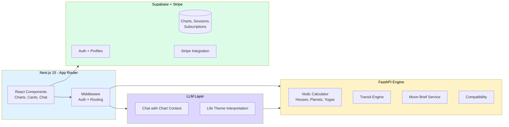

# Astra

> **Vedic astrology, reinterpreted with AI.**
> Birth chart analysis, daily Moon Brief, transit-aware horoscopes, and an AI chat that grounds its responses in your actual chart — not generic horoscope filler.


---

## Why this exists

Most astrology apps are either entertainment-grade horoscopes (generic, decoupled from any actual chart) or computational ephemeris tools (accurate but unreadable for non-practitioners). **Astra sits in the middle**: a serious Vedic computation engine paired with an LLM layer that explains what your chart actually means in plain language, with the ability to ask follow-up questions grounded in your specific placements.

The thesis: AI doesn't replace the astrologer's interpretive craft — it makes the interpretive layer accessible to people who don't have a personal astrologer.

## Architecture



**Two-tier backend** — a FastAPI engine for deterministic Vedic computations (houses, planets, dashas, yogas, transits) and an LLM layer for explanation. The engine is a pure function over (birth date / time / place); the LLM is stateless per request, with chart context injected as structured prompt scaffolding.

## Engineering decisions

| Concern | Choice | Rationale |
|---|---|---|
| Engine isolation | **Separate FastAPI service** | Astrology calculations are CPU-bound and deterministic — keep them out of the request path of the Next.js server, cache aggressively |
| LLM | **GPT-4o-mini** | Cost-efficient for chat-volume workloads; instruction-following is strong enough for chart-grounded responses |
| Chat sessions | **Persisted in Postgres** | Full history with on-demand recall via session sidebar; sessions are append-only to support audit |
| Streaming | **Server-Sent Events** | Reliable across networks; no socket overhead; controller close is guarded against double-close errors |
| Auth | **Supabase Auth + middleware** | Centralised route protection in `middleware.ts`; role and subscription state checked on every request |
| Payments | **Stripe** with monthly + yearly price tiers | Standard subscription model with webhook-driven state |
| Testing | **Playwright E2E (45 tests)** | 33 smoke + 12 authenticated; catches rendering regressions; smoke runs without auth, deeper suite logs in |

## Key features

- **Birth chart generation** — D1 (Rashi), D9 (Navamsa), with a Vedic gating layer for premium tier
- **Moon Brief** — daily mood, activities, and remedies based on the transiting moon
- **Life themes** — interpretive cards mapping dominant yogas to life domains, with full descriptions
- **AI chat** — grounded in your chart, with session management and on-demand history
- **Quick-link prompts** — auto-send pre-filled prompts from the dashboard
- **Horoscope page** — short-form daily reading, expandable to full
- **Subscriptions** — Stripe-powered monthly / yearly tiers

## Status

- **211+ commits** across feature work
- **45 E2E tests passing** (33 smoke + 12 authenticated)
- **18 routes** wired and rendering
- All sub-projects (1–4) built; currently in testing phase
- Open work: deployment pipeline, security hardening pass, SEO, settings module

## Tech stack

**Frontend:** Next.js 15 (App Router), React 18, TypeScript, Tailwind, server components
**Engine:** FastAPI, Python 3.11, Vedic astronomy libraries
**LLM:** OpenAI GPT-4o-mini, custom prompt scaffolding for chart grounding
**Data:** Supabase (Postgres, Auth, Storage), Stripe (subscriptions)
**Testing:** Playwright (E2E), Pytest (engine unit tests)
**Auth & routing:** Next.js middleware with subscription-state checks

## Local development

```bash
# Frontend (Next.js)
npm install
cp .env.local.example .env.local  # fill credentials
npm run dev  # http://localhost:3000

# Engine (FastAPI)
cd engine
python -m venv venv && source venv/Scripts/activate
pip install -r requirements.txt
cp .env.example .env  # fill INTERNAL_SECRET
uvicorn app.main:app --reload  # http://localhost:8000
```

## Roadmap

- [x] Vedic chart engine (D1, D9, dashas, yogas)
- [x] Moon Brief daily service
- [x] Life themes interpretation cards
- [x] Chat with chart context + sessions
- [x] Stripe subscription wiring
- [x] Playwright E2E suite
- [ ] Production deployment
- [ ] SEO + landing page polish
- [ ] Settings module
- [ ] Transit-based horoscope automation

## About

Built by **Sadip Wagle** — AI Solutions Architect, formerly Co-Founder of **Datambit (London, 2023–2025)** with production AI experience for the **UK Home Office, Royal Navy, Mastercard,** and **Nationwide**. Currently based in Kathmandu, building indigenous AI products for Nepal and global markets.

- **LinkedIn:** [sadip-wagle](https://www.linkedin.com/in/sadip-wagle-711245b7/)
- **GitHub:** [@wsadip-tech-ai](https://github.com/wsadip-tech-ai)
- **Email:** wsadip@gmail.com

---

*Astra is part of a portfolio that also includes [KaraDarpan](https://github.com/wsadip-tech-ai/KaraDarpan) (tax AI), [Kaam](https://github.com/wsadip-tech-ai/Kaam) (home services), [WedMe](https://github.com/wsadip-tech-ai/WedMe) (event direct-booking), and [PartyPour](https://github.com/wsadip-tech-ai/PartyPour) (event beverage planning).*
